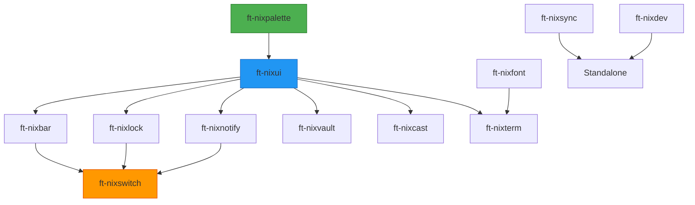

# Prompt: Set Up Docusaurus Documentation for FT-nixforge Community

## Context

We are moving all documentation, ideas, and community content from the local `ideas/` folder in the NixOS config repo to a **dedicated GitHub repository** under the [`FT-nixforge`](https://github.com/FT-nixforge) organization.

The new repo (e.g. `github:FT-nixforge/community`) will be the central hub for:
- **Documentation** (Docusaurus-powered site, deployed to GitHub Pages)
- **Community discussions** (GitHub Discussions enabled)
- **Issue tracking** (for feature requests, bugs across all flakes)
- **Roadmap & ideas** (the content currently in `ideas/`)

---

## Task 1: Initialize Docusaurus with GitHub Pages + Actions

Create a new repository `FT-nixforge/community` (or similar name) and set up:

### 1.1 Docusaurus Installation

```bash
npx create-docusaurus@latest community classic --typescript
```

Use the **classic** preset with **TypeScript** support.

### 1.2 Configure `docusaurus.config.ts`

Key settings:

```typescript
const config: Config = {
  title: 'FT-nixforge',
  tagline: 'A cohesive NixOS desktop ecosystem',
  favicon: 'img/favicon.ico',

  // GitHub Pages deployment
  url: 'https://ft-nixforge.github.io',
  baseUrl: '/community/',
  organizationName: 'FT-nixforge',
  projectName: 'community',
  deploymentBranch: 'gh-pages',
  trailingSlash: false,

  // Enable GitHub Discussions / Issues
  customFields: {
    githubOrg: 'FT-nixforge',
  },

  // Navigation
  themeConfig: {
    navbar: {
      title: 'FT-nixforge',
      logo: { alt: 'FT-nixforge Logo', src: 'img/logo.svg' },
      items: [
        { to: '/docs/intro', label: 'Docs', position: 'left' },
        { to: '/docs/flakes/done', label: 'Flakes', position: 'left' },
        { to: '/blog', label: 'Blog', position: 'left' },
        {
          href: 'https://github.com/FT-nixforge',
          label: 'GitHub',
          position: 'right',
        },
      ],
    },
    footer: {
      style: 'dark',
      links: [
        {
          title: 'Flakes',
          items: [
            { label: 'ft-nixpalette', href: 'https://github.com/FT-nixforge/nixpalette' },
            { label: 'ft-nixprism', href: 'https://github.com/FT-nixforge/nixprism' },
          ],
        },
        {
          title: 'Community',
          items: [
            { label: 'Discussions', href: 'https://github.com/FT-nixforge/community/discussions' },
            { label: 'Issues', href: 'https://github.com/FT-nixforge/community/issues' },
          ],
        },
      ],
      copyright: `Copyright © ${new Date().getFullYear()} FT-nixforge.`,
    },
  },

  presets: [
    [
      'classic',
      {
        docs: {
          sidebarPath: './sidebars.ts',
          editUrl: 'https://github.com/FT-nixforge/community/tree/main/',
        },
        blog: {
          showReadingTime: true,
          editUrl: 'https://github.com/FT-nixforge/community/tree/main/',
        },
        theme: {
          customCss: './src/css/custom.css',
        },
      },
    ],
  ],
};
```

### 1.3 GitHub Actions Workflow for Pages Deployment

Create `.github/workflows/deploy.yml`:

```yaml
name: Deploy to GitHub Pages

on:
  push:
    branches: [main]
  workflow_dispatch:

permissions:
  contents: read
  pages: write
  id-token: write

concurrency:
  group: pages
  cancel-in-progress: false

jobs:
  build:
    runs-on: ubuntu-latest
    steps:
      - uses: actions/checkout@v4
      - uses: actions/setup-node@v4
        with:
          node-version: 20
          cache: npm
      - name: Install dependencies
        run: npm ci
      - name: Build
        run: npm run build
      - name: Upload artifact
        uses: actions/upload-pages-artifact@v3
        with:
          path: build

  deploy:
    needs: build
    runs-on: ubuntu-latest
    environment:
      name: github-pages
      url: ${{ steps.deployment.outputs.page_url }}
    steps:
      - name: Deploy to GitHub Pages
        id: deployment
        uses: actions/deploy-pages@v4
```

### 1.4 Enable GitHub Pages

In the repo settings:
- **Settings → Pages → Build and deployment → Source**: GitHub Actions
- **Settings → General → Discussions**: Enable
- **Settings → General → Issues**: Enable

---

## Task 2: Generate Documentation from Ideas Files

Convert the content from `ideas/IDEAS-done.md`, `ideas/IDEAS-priority.md`, and `ideas/IDEAS-flakes.md` into structured Docusaurus docs.

### 2.1 Folder Structure

```
docs/
├── intro.md                          # Welcome / overview
├── philosophy.md                     # Design principles (no sub-flake deps)
├── flakes/
│   ├── _category_.json               # label: "Flakes", position: 2
│   ├── done.md                       # Completed flakes (from IDEAS-done.md)
│   ├── priority.md                   # Build roadmap (from IDEAS-priority.md)
│   └── experimental.md               # Wildcard ideas (from IDEAS-flakes.md)
└── ecosystem/
    ├── _category_.json               # label: "Ecosystem", position: 3
    └── dependency-graph.md           # Visual dependency graph
```

### 2.2 Dropdown Sidebar for Feature-Specific Sub-Flakes

For flakes that have **sub-flakes** (e.g. `ft-nixpalette` has `ft-nixpalette-hyprland`), use Docusaurus **dropdown categories** in the navbar or **collapsible sidebar categories**.

Example `sidebars.ts`:

```typescript
const sidebars: SidebarsConfig = {
  docsSidebar: [
    'intro',
    'philosophy',
    {
      type: 'category',
      label: 'Flakes',
      collapsed: false,
      items: [
        'flakes/done',
        'flakes/priority',
        'flakes/experimental',
      ],
    },
    {
      type: 'category',
      label: 'Ecosystem',
      collapsed: false,
      items: [
        'ecosystem/dependency-graph',
        {
          type: 'category',
          label: 'ft-nixpalette Family',
          collapsed: true,
          items: [
            {
              type: 'doc',
              id: 'flakes/done',
              label: 'ft-nixpalette (core)',
            },
            {
              type: 'link',
              label: 'ft-nixpalette-hyprland (bundle)',
              href: 'https://github.com/FT-nixforge/nixpalette-hyprland',
            },
          ],
        },
      ],
    },
  ],
};
```

For **navbar dropdowns** (top-level navigation):

```typescript
// In docusaurus.config.ts → themeConfig.navbar.items
{
  type: 'dropdown',
  label: 'Flakes',
  position: 'left',
  items: [
    { type: 'doc', docId: 'flakes/done', label: 'Completed' },
    { type: 'doc', docId: 'flakes/priority', label: 'Roadmap' },
    { type: 'doc', docId: 'flakes/experimental', label: 'Experimental' },
    { type: 'html', value: '<hr class="dropdown-separator">' },
    {
      type: 'dropdown',
      label: 'ft-nixpalette ▼',
      items: [
        { label: 'Core', href: '/docs/flakes/done#ft-nixpalette' },
        { label: 'Hyprland Bundle', href: 'https://github.com/FT-nixforge/nixpalette-hyprland' },
      ],
    },
  ],
}
```

> Note: Nested dropdowns in the navbar may need custom CSS. Alternatively, use a single flat dropdown with clear labels like `ft-nixpalette (core)` and `ft-nixpalette-hyprland (bundle)`.

### 2.3 Content Mapping

| Source File | Destination | Notes |
|-------------|-------------|-------|
| `IDEAS-done.md` | `docs/flakes/done.md` | Completed flakes with status badges |
| `IDEAS-priority.md` | `docs/flakes/priority.md` | Tiered roadmap with dependency graph |
| `IDEAS-flakes.md` | `docs/flakes/experimental.md` | Wildcard ideas table |
| Design principle (no sub-flake deps) | `docs/philosophy.md` | Core design rule |
| Dependency graphs | `docs/ecosystem/dependency-graph.md` | Mermaid diagrams |

### 2.4 Mermaid Diagrams

Enable Mermaid in `docusaurus.config.ts`:

```typescript
markdown: {
  mermaid: true,
},
themes: ['@docusaurus/theme-mermaid'],
```

Then use Mermaid for dependency graphs in `docs/ecosystem/dependency-graph.md`:

```markdown
## Dependency Graph


```

---

## Task 3: Styling & Branding

### 3.1 Custom CSS (`src/css/custom.css`)

```css
:root {
  --ifm-color-primary: #5277c3;
  --ifm-color-primary-dark: #4668b0;
  --ifm-color-primary-darker: #3d5c9e;
  --ifm-color-primary-darkest: #2f487a;
  --ifm-color-primary-light: #6a8dcd;
  --ifm-color-primary-lighter: #82a3d7;
  --ifm-color-primary-lightest: #b0c8e8;
  --ifm-code-font-size: 95%;
  --docusaurus-highlighted-code-line-bg: rgba(82, 119, 195, 0.1);
}

[data-theme='dark'] {
  --ifm-color-primary: #82a3d7;
  --ifm-color-primary-dark: #6a8dcd;
  --ifm-color-primary-darker: #5277c3;
  --ifm-color-primary-darkest: #3d5c9e;
  --ifm-color-primary-light: #a0bde3;
  --ifm-color-primary-lighter: #b0c8e8;
  --ifm-color-primary-lightest: #d0e0f0;
  --docusaurus-highlighted-code-line-bg: rgba(130, 163, 215, 0.1);
}
```

### 3.2 Status Badges

Use Docusaurus admonitions for flake status:

```markdown
:::tip[Status: ✅ Done]
ft-nixpalette is complete and integrated.
:::

:::info[Status: 🚧 In Progress]
ft-nixbar has a temporary eww config.
:::

:::caution[Status: 📋 Planned]
ft-nixlock is planned for next quarter.
:::
```

---

## Task 4: Final Checklist

- [ ] Repo `FT-nixforge/community` created with Discussions + Issues enabled
- [ ] Docusaurus initialized with TypeScript
- [ ] `docusaurus.config.ts` configured for GitHub Pages (`/community/` baseUrl)
- [ ] GitHub Actions workflow `.github/workflows/deploy.yml` created
- [ ] Pages source set to "GitHub Actions" in repo settings
- [ ] All `ideas/` content migrated to `docs/` with proper structure
- [ ] Dropdown/collapsible sections for feature-specific sub-flakes (e.g. ft-nixpalette → ft-nixpalette-hyprland)
- [ ] Mermaid dependency graphs added
- [ ] Custom CSS with FT-nixforge branding
- [ ] First deployment successful at `https://ft-nixforge.github.io/community/`

---

*This prompt was generated on 2026-04-19 for the FT-nixforge ecosystem.*
